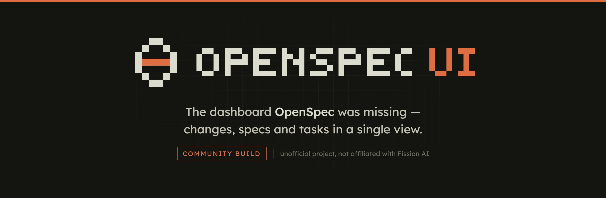
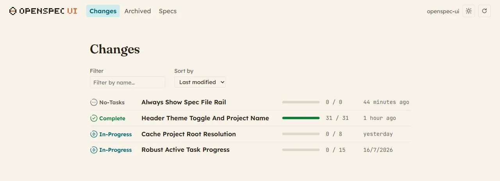
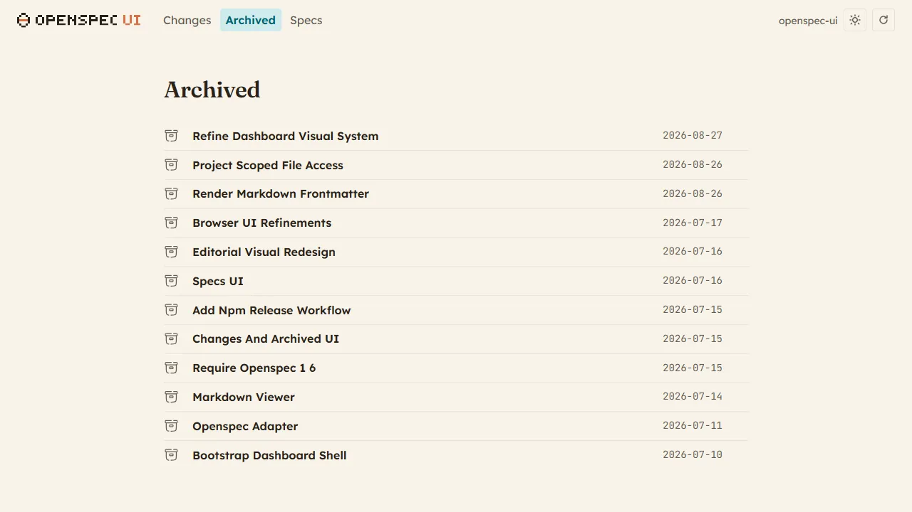
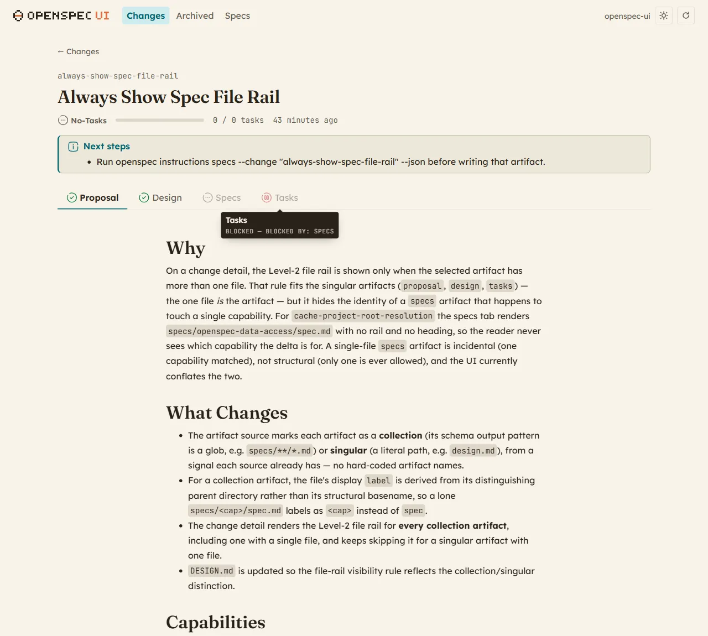
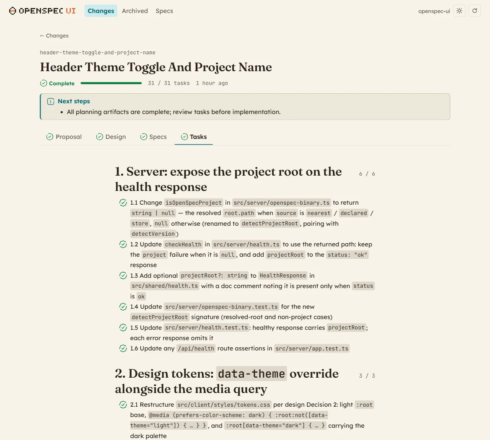
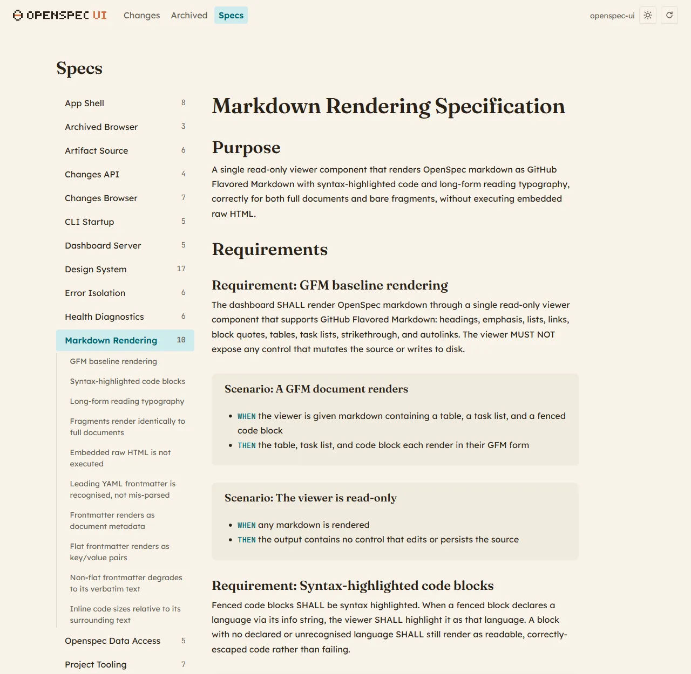
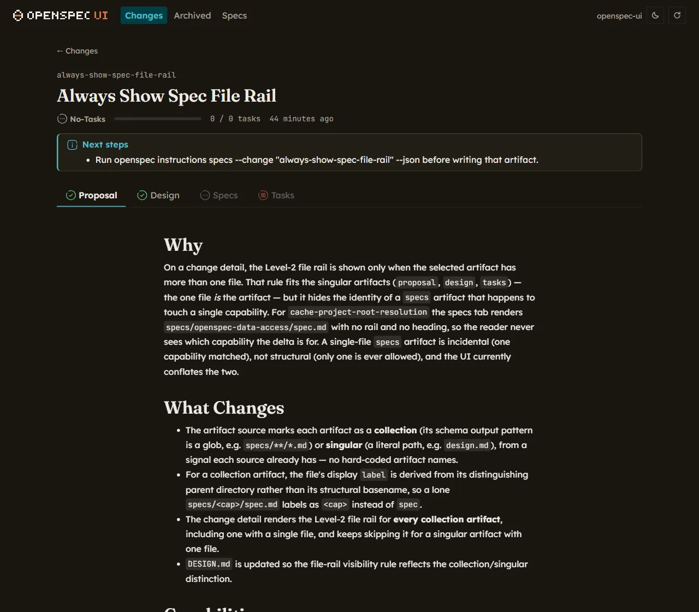

<p align="center">
  
</p>

# openspec-ui

> A read-only dashboard for browsing [OpenSpec](https://github.com/Fission-AI/OpenSpec) changes, archives and specs — one command, no configuration.

OpenSpec keeps a project's proposals, designs, specs and task lists on disk as markdown. That's ideal for agents and terrible for reading: to know where a change stands you open four files, count checkboxes by hand, and lose the thread between the spec and the change that modifies it. `openspec-ui` runs a local server over the same data and renders it — status, task progress, artifacts and specs — in a browser.

It reads. It never writes: the dashboard has no button that can modify your OpenSpec tree.

```bash
npx @loureirodev/openspec-ui
```

**Workflow:**

1. **Run** `openspec-dashboard` inside any OpenSpec project
2. **Browse** active changes, their artifacts and task progress
3. **Cross-check** the specs the change touches, and the archive of what shipped
4. **Refresh** — the data is re-read from disk on demand, so it follows your agent's edits

## Screenshots

<table>
<tr>
<td width="50%" valign="top">

**Changes** — every active change with its status, task progress and last activity, filterable and sortable.
</td>
<td width="50%" valign="top">

**Archived** — everything already shipped, newest first.
</td>
</tr>
<tr>
<td valign="top"></td>
<td valign="top"></td>
</tr>
<tr>
<td width="50%" valign="top">

**Change detail** — the artifacts of one change as tabs, each marked done, ready or blocked, with next-step guidance and the rendered markdown.

</td>
<td width="50%" valign="top">

**Tasks** — the task list with per-section counters, so progress is visible without counting checkboxes.

</td>
</tr>
<tr>
<td valign="top"></td>
<td valign="top"></td>
</tr>
<tr>
<td width="50%" valign="top">

**Specs** — the capability specs of the project, with a requirement index alongside the rendered spec and `SHALL` / `WHEN` / `THEN` highlighted.

</td>
<td width="50%" valign="top">

**Dark theme** — follows the operating system's colour scheme, with a top-bar toggle to override it for the session.

</td>
</tr>
<tr>
<td valign="top"></td>
<td valign="top"></td>
</tr>
</table>

## Installation

Run it without installing:

```bash
npx @loureirodev/openspec-ui
```

Or install it globally:

```bash
npm install -g @loureirodev/openspec-ui
```

Also available from GitHub Packages — configure `.npmrc` first:

```
@loureirodev:registry=https://npm.pkg.github.com
```

### Requirements

- Node.js >= 22
- [`openspec`](https://github.com/Fission-AI/OpenSpec) >= 1.6.0 on your `PATH`
- An OpenSpec project (a directory with `openspec/`)

If the binary is missing or too old, the dashboard still starts and tells you exactly what it found — the diagnostic is rendered in the browser rather than hidden behind an exit code.

## Usage

```bash
# Browse the OpenSpec project in the current directory
openspec-dashboard

# Bind a specific port (falls back to the next free one if it's taken)
openspec-dashboard --port 8080

# Don't open a browser
openspec-dashboard --no-open
```

### CLI Options

```
Options:
  --port <number>  Port to bind, with sequential fallback (default: 4321)
  --no-open        Do not open the browser after the server starts
  --help           Print this message and exit
  --version        Print the dashboard and openspec versions and exit
```

`--version` prints both the dashboard's version and the `openspec` binary it resolved, which is the fastest way to check an environment:

```
$ openspec-dashboard --version
openspec-dashboard 0.2.0
openspec 1.6.0 (/usr/local/bin/openspec)
```

## Features

- **Changes browser**: status, task progress and last activity for every active change, with name filtering and sorting
- **Artifact tabs**: proposal, design, specs and tasks per change, each labelled complete or missing
- **Task progress**: checkboxes aggregated per change and per task section
- **Specs browser**: capability specs with a requirement index and deep links into individual requirements
- **Archive**: completed changes, newest first, with their artifacts still readable
- **Schema-aware**: reads the change's declared schema, and says when one had to be inferred
- **Semantic markdown**: `SHALL` / `WHEN` / `THEN` keywords, scenario blocks and frontmatter rendered as first-class elements
- **Error isolation**: a broken change or an unreadable file degrades that one panel, never the whole page
- **Light and dark themes**: follows the OS colour scheme
- **Read-only by design**: no endpoint writes to the OpenSpec tree
- **Cross-platform**: Linux, macOS and WSL2

## Future

- Live reload when files change on disk, instead of manual refresh
- Diff view between a change's delta spec and the main spec it modifies
- Full-text search across changes and specs
- Keyboard navigation between changes, artifacts and requirements

## Contributing

Contributions are welcome. The project uses [pnpm](https://pnpm.io):

```bash
pnpm install
pnpm dev        # client (Vite) + server, in parallel
pnpm test       # vitest
pnpm lint       # biome
pnpm typecheck  # tsc --noEmit
pnpm build      # client + server into dist/
```

The visual design system — colour tokens, typography, the status-icon vocabulary and the stylesheet conventions — is documented in [`DESIGN.md`](./DESIGN.md), and it's the source of truth for anything the UI renders. Agent-facing conventions live in [`AGENTS.md`](./AGENTS.md).

## Disclaimer

This is an unofficial community project. It is not affiliated with or endorsed by Fission AI, the authors of OpenSpec.

## License

MIT
